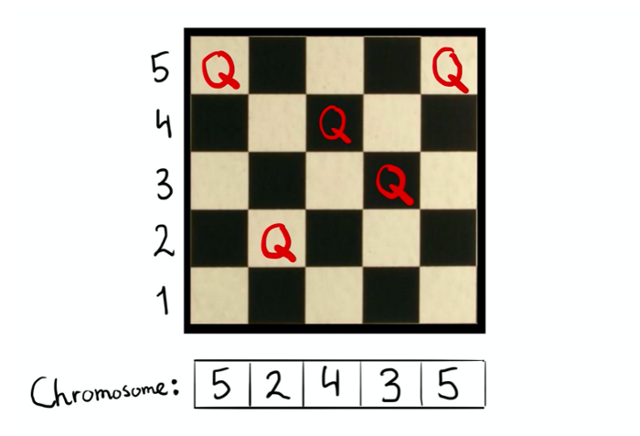

# Solving the 5-Queens problem using Genetic Algorithm

Explanation with examples of solving 5-Queens problem by using Genetic Algorithm.


## Author

Arman Assankhanov ([arman@pusan.ac.kr](arman@pusan.ac.kr)), Pusan National University


## What is N-Queen problem?

First of all N-Queen problem is the problem where we need to find an arrangement of N queens on chess board, such that no queen can attack any other queens on the board. So in our 5-Queens problem we need to placing 5 chess queens on an 5×5 chessboard so that no two queens attack each other. When we find all possible cases, it would look as the following:


## Steps which we need to do

In our task we need to solve the 5-Queen problem using Genetic Algorithm. We need to use the principle of evolution to find a solution to a problem.
In order to solve the 5-Queen problem the following steps are needed:
1) Chromosome design
2) Initialization
3) Fitness evaluation
4) Selection
5) Crossover
6) Mutation
7) Update generation
8) Go back to 3)
Let’s briefly explain each step of solving 5-Queens problem using Genetic Algorithm.

## 1) Chromosome design

Firstly, we need to create chromosome representation. For showing chromosome the best way is to represent it as a list of length N where in our case N=5. The value of each index shows the row of the queen in a column. The value of each index is from 1 to 5.





## 2) Initialization

In initialization process, we need to arrange a random population of chromosomes (potential solutions) are created. Here as the initial population I took 4 chromosomes, each of it has length 5. They are

``` bash
[5 2 4 3 5]
[4 3 5 1 4]
[2 1 3 2 4]
[5 2 3 4 1]
```


In particularly, this chromosomes can be shown as the following on the chess board:


## 3) Fitness evaluation

First of all, fitness function is pairs of non-attacking queens. So, higher scores are better is better for us. In order to solve the fitness function for the chromosome [5 2 4 3 5], I assigned each queen uniquely as Q1, Q2, Q3, Q4 and Q5. And to find fitness function value I made the following equation:
Fitness function = F1+F2+F3+F4+F5
where:
```bash
F1 = number of pairs of non-attacking queens with queen Q1.
F2 = number of pairs of non-attacking queens with queen Q2.
F3 = number of pairs of non-attacking queens with queen Q3.
F4 = number of pairs of non-attacking queens with queen Q4.
F5 = number of pairs of non-attacking queens with queen Q5
```

Here for example if we already counted pair Q1 and Q2 to F1, we should not count the same pair Q2 and Q1 to F2.
So we found that for chromosome [5 2 4 3 5] the fitness function will be equal to 7.


We should evaluate all of our population individuals(chromosomes) using the fitness function. So fitness functions will be the following:
``` bash
[5 2 4 3 5] Fitness Function = 7
[4 3 5 1 4] Fitness Function = 6
[2 1 3 2 4] Fitness Function = 6
[5 2 3 4 1] Fitness Function = 5
```


Then we need to compute the probability of being chosen from fitness function. This will be needed for the next selection step. First, we need to add all fitness functions which will be equal as the following:
7+6+6+5=24
Then we need to compute probability of being chosen from fitness function. We need to divide the fitness function to the sum of fitness function and multiply it to 100%.

``` bash
[5 2 4 3 5] probability of being chosen = 7/24 *100% = 29%
[4 3 5 1 4] probability of being chosen =6/24 * 100% = 25%
[2 1 3 2 4] probability of being chosen =6/24 * 100% = 25%
[5 2 3 4 1] probability of being chosen =5/24 * 100% = 21%
```


## 4) Selection

In the next step we randomly choose the two pairs to reproduce based on probabilities which we counted on the previous step. In other words certain number of chromosomes will survive into next generator using selection operator. Here selected chromosomes act as parents that are combined using crossover operator to make children. In addition to this, we pick a crossover point per pair.
Here we took randomly following chromosomes based on their probabilities:
``` bash
[4 3 5 1 4]
[5 2 4 3 5]
[4 3 5 1 4]
[2 1 3 2 4]
```
We can notice that we did not take the chromosome [5 2 3 4 1] because it’s probability of being chosen is the least among chromosomes.
For the first pair
``` bash
[4 3 5 1 4]
[5 2 4 3 5]
```
The crossover point will be picked after two genes.
In the case of second pair
``` bash
[4 3 5 1 4]
[2 1 3 2 4]
```
The crossover point will be picked after three genes.
Here we go to the next step because our fitness value is not equal to Fmax which is the maximum number fitness value in the chromosome which satisfy the condition of solution of 5-Queen problem. Fmax is equal to 10.


## 5) Crossover

In crossover, selected chromosomes act as parents that are combined using crossover operator to make children. In other words, it combines the genetic information of two parents to generate new offspring.
Here we can see that children generated from the first pair ([4 3 5 1 4] and [5 2 4 3 5]) are the following:
``` bash
[4 3 4 3 5]
[5 2 5 1 4]
```
From the second pair ([4 3 5 1 4] and [2 1 3 2 4]) the children are the following:
``` bash
[4 3 5 2 4]
[2 1 3 1 4]
```
In other words, in order to create first child from pair in crossover process we took the parent #1 chromosome first part and parent #2 chromosome second part which makes the new individual which consist of
[(first part of parent #1 chromosome) [(second part of parent #2 chromosome)]
In order to create the second child we from the same pair we took the parent #1 chromosome second part and parent #2 chromosome first part which makes the new individual which consist of
[(second part of parent #1 chromosome) [(first part of parent #2 chromosome)]
So in our case when we create the children of pair [4 3 5 1 4] and [5 2 4 3 5], for producing the first child, we took [(first part of parent #1 chromosome) [(second part of parent #2 chromosome)] = [ 4 3 4 3 5]
For producing second child, we took [(second part of parent #1 chromosome) [(first part of parent #2 chromosome)] = [5 2 5 1 4]
The same process we will do to the second pair ([4 3 5 1 4] and [2 1 3 2 4]).


## 6) Mutation


The next step is mutation. In mutation process we alter one or more gene values in chromosomes which we found after crossover. So it randomly changes few gens and the mutation probability is low. So in our example, our mutation will look as the following:
``` bash
[4 3 4 3 5] →[4 3 1 3 5]
[5 2 5 1 4] →[5 2 3 1 4]
[4 3 5 2 4] →[4 3 5 2 4]
[2 1 3 1 4] →[2 1 3 5 4]
```
where we can notice that the third gene in the chromosome [4 3 4 3 5] changed from 4 to 1.
Also third gene in the chromosome [5 2 5 1 4] changed from 5 to 3. In addition to this, fourth gene in the chromosome [2 1 3 1 4] changed from 1 to 5.


So until this, the genetic algorithm to solve 5-Queen algorithm will look as the following:


## 7) Update generation

On the next step we need to update the generation. New chromosomes will update the population but the population number will not change. So the chromosomes
``` bash
[4 3 1 3 5]
[5 2 3 1 4]
[4 3 5 2 4]
[2 1 3 5 4]
```
Will be our new population.


## 8) Go back to step 3

So on the next step we need to comeback to step 3 (fitness evaluation) to find the fitness function of our updated population.
Steps 3–7 are repeated until chromosome (solution) will satisfy the following:
Fitness value == Fmax
Where Fmax is equal to 10


## References:
1) [Solving N Queen Problem using Genetic Algorithm](https://www.researchgate.net/publication/281953623_Solving_N_Queen_Problem_using_Genetic_Algorithm)
2) [Video explanation of solving 5 Queen Problem using Genetic Algorithm](https://www.youtube.com/watch?v=qt85_CinKwo&list=LL2WjQFuALy8Sqvy-YgQvPuQ&index=3)

## Post has been originally published at:
At [Medium](https://medium.com/@vrmvn01/solving-the-5-queens-problem-using-genetic-algorithm-8f5aab6af020) story

## License:
[MIT License](https://choosealicense.com/licenses/mit/)   